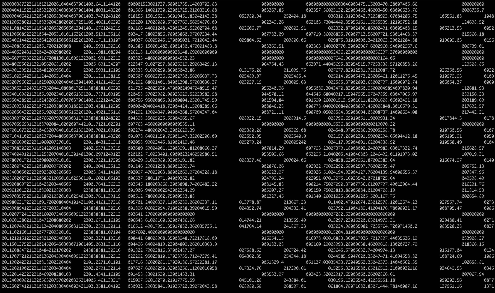

# Prepared Datasets for ID529 — Data Management and Analytic Workflows in R

This is an R package that you can install with the following code: 

```r
# install devtools if you haven't already
install.packages("devtools")

library(devtools)
devtools::install_github("ID529/ID529data")
```

## Overview 

We've prepared the following datasets for you: 

- A sample of measures and participants from NHANES III (1988-1994)
- County level data from CDC WONDER on heart-disease mortality
- A sample of data from the NLSY on education, race/ethnicity, alcohol use, and 
  life satisfaction

### NHANES III (1988-1994)

[NHANES](https://wwwn.cdc.gov/nchs/nhanes/) stands for the National Health and
Nutrition Examination Survey, which is a survey that has been conducted by CDC's
National Center for Health Statistics going back to 1971 under the name NHANES
and had predecessors that started in 1959.  The NHANES data are repeated
cross-sectional data of a nationwide probability sample.

We're using NHANES III as one of our example datasets because of its older
formatting and the unique features that come with that.  Back in the day, data
used to be stored on magnetic tape reels (imagine like a bigger, older version
of a music tape cassette) and because data storage was much more expensive,
certain techniques were used to maximize the density with which data was stored.


The most salient aspect that researchers need to deal with on a regular basis is
figuring out how to deal with what are called "fixed width files" where every 
row of the data contain the same number of characters. 

If you open up the file, you'll find a couple things: 

  1. It's really just a text-file
  2. Every line has the same number of characters
  3. There's a lot of spaces where data were not recorded (e.g., for people for whom the questions did not apply)
  4. Basically all of it is numeric data.  Some of them are integers and some are 
     real valued (i.e., decimal numbers)



You can find the documentation for NHANES III here:
<https://wwwn.cdc.gov/nchs/nhanes/nhanes3/default.aspx>.  The documentation
explains in details how all of this data is structured, but the basic story goes: 
you hunt through the documentation for whatever variable you're looking for, it 
tells you what "position" it's in (meaning, what columns, and often that's a range, like for example
household size is in columns 27-28).

One of the most important aspects to pay attention to in using any survey data 
is the use of survey weights and sampling strata.  Documentation from NHANES on their creation and 
recommended usage of the survey weights and sampling strata included is available 
here <https://wwwn.cdc.gov/nchs/data/nhanes3/manuals/wgt_exec.pdf>.

Two modern tools available in R will be indespensible in dealing with these 
data in a way that doesn't make you pull your hair out: 

  - [read_fwf](https://readr.tidyverse.org/reference/read_fwf.html), and 
  - the [survey](https://cran.r-project.org/web/packages/survey/index.html) package, which helps users to handle survey strata and weighting
  as described [here](https://stats.oarc.ucla.edu/r/faq/how-do-i-analyze-survey-data-with-a-stratified-design-with-certainty-psus/)

### CDC WONDER


### NLSY
